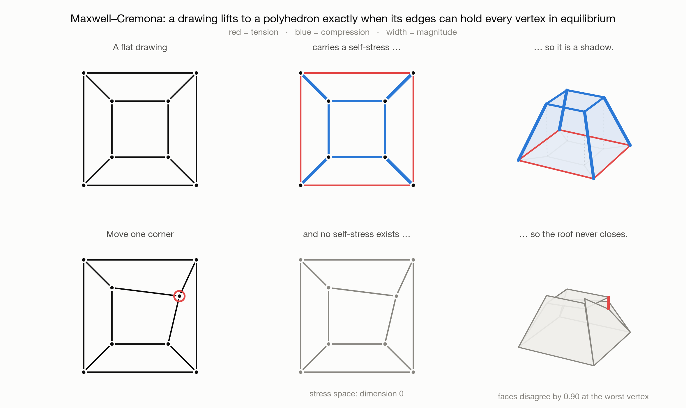
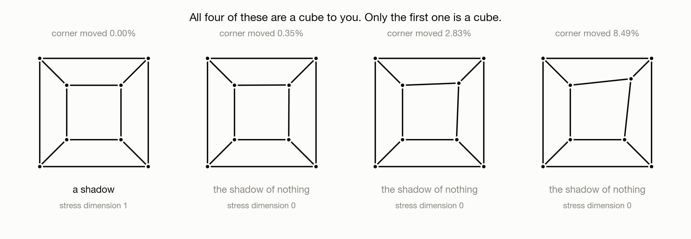
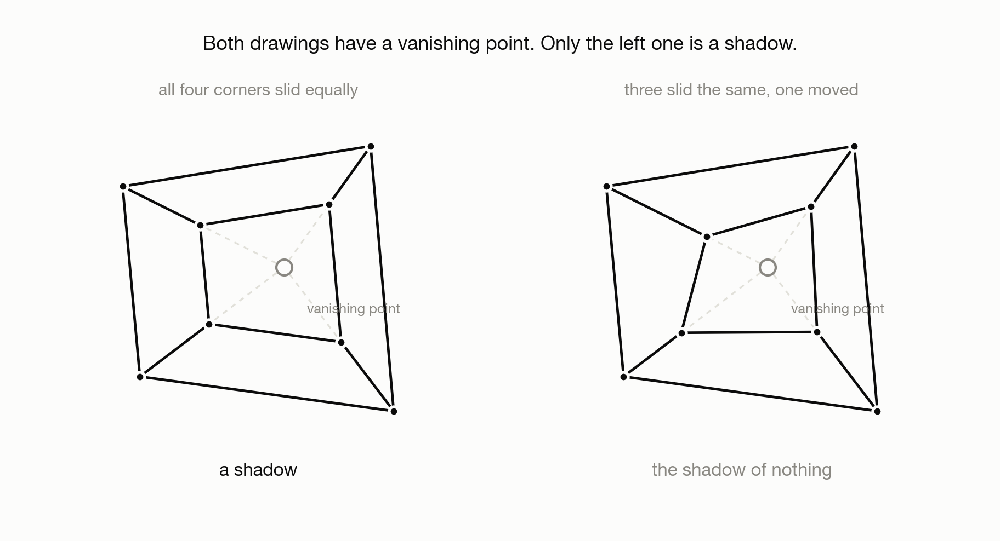
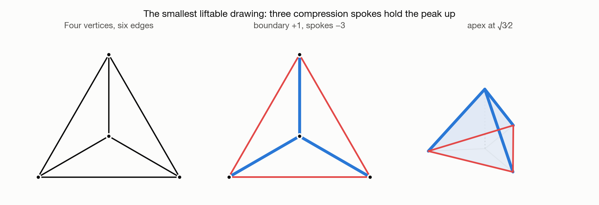

# `GA-001` — When Is a Flat Drawing the Shadow of a Solid?

**Area:** Geometric AI &nbsp;·&nbsp; **Type:** Concept &nbsp;·&nbsp; **Status:** Complete &nbsp;·&nbsp; **Date:** 2026-08-16



> **Try it:** [Maxwell's Shadow Test](https://claude.ai/code/artifact/ed5a605e-92a6-4b24-97d6-0c7ed142d9cb)
> — drag a vertex; the test reruns on every move.
> First of four notes on the Maxwell–Cremona correspondence.

---

## Question

Given a planar graph drawn with straight edges, when is that drawing the
orthogonal projection of a polyhedral surface in three dimensions?

## Motivation

Three dimensions to two is simple. Point a camera at a solid, drop a coordinate,
and the drawing is finished. However, going back is not merely harder; much of the time
there is nothing to go back to. A drawing can have sensible polygonal faces and
no crossings, and still admit no set of planes that projects onto it — not
planes that are hard to find, but none at all.

So: which flat drawings are the real ones? What creates the difficulty, and can
it be counted? And is there a test or a condition a straight-line planar
drawing must satisfy,  before it can be pulled up into three dimensions, and that a computer can check?

All of this was settled in 1864, by Maxwell, in a paper about trusses. It's not common that a 150 year-old problem still resonates in computer science. But this problem still matters in graph theory, graphics, computational geometry and many other fields.

## Intuition

Fold the drawing along its edges, as though it were a sheet of paper. Each edge
becomes a ridge or a valley and carries a single number: how sharply it folds.
Call that number `ω_e`.

The folds must agree at every vertex. Walk once around a vertex, adding up the
height changes edge by edge, and the total has to return to zero. That closing
condition is the only requirement. If every vertex satisfies it, the folds
assemble into a surface.

Written out, the closing condition at vertex `i` is

```
    Σ  ω_ij (p_j − p_i)  =  0
   j~i
```

which is also the condition for vertex `i` to stay put when its edges pull on
it with forces `ω_e`. Maxwell's observation is that these are the same
equation. Deciding whether a drawing is a shadow therefore reduces to asking
whether a homogeneous linear system has a non-zero solution.

The force vocabulary is worth keeping, because the signs carry meaning:
`ω > 0` is tension and bends the fold one way, `ω < 0` is compression and bends
it the other. A drawing whose interior edges all share a sign is the projection
of a convex polyhedron.

## Method

A **planar framework** is a planar graph `G = (V, E)` with `n` vertices and
`m` edges, drawn with straight edges at positions `p : V → ℝ²`. A
**self-stress** is a vector `ω ∈ ℝ^m` satisfying the equilibrium equation above
at every vertex. Collecting those `2n` scalar equations gives the `m × 2n`
**rigidity matrix** `R(p)`, whose transpose has the self-stresses as its
kernel:

```
    dim (self-stress space)  =  m − rank R(p)
```

The rank is what matters. The more familiar expression `m − 2n + 3` assumes the
framework is infinitesimally rigid, so that `rank R = 2n − 3`, the deficit of
three accounting for two translations and one rotation. Drawings that lift are
exactly those where the rank falls below its generic value.

A **lift** is a continuous `z : ℝ² → ℝ` that is affine on each face,
`z(x) = ⟨a_f, x⟩ + b_f`. The correspondence is then:

> A drawing admits a non-trivial lift if and only if it carries a non-zero
> self-stress, and each determines the other.

<details>
<summary><strong>The proof, both directions</strong></summary>

Write `R₉₀` for the counterclockwise quarter turn `(x, y) ↦ (−y, x)`.

**Lift ⇒ stress.** Let `e = uv` be an edge with face `f` on its left and `g`
on its right. Continuity of `z` along `e` means `⟨a_f − a_g, x⟩ + (b_f − b_g)`
vanishes for every `x` on the line through `p_u` and `p_v`. So `a_f − a_g` is
normal to `e`, and since `R₉₀(p_v − p_u)` spans that normal line, there is a
scalar `ω_e` with

```
    a_f − a_g  =  ω_e · R₉₀(p_v − p_u)
```

Walk once around a vertex `i`, through its neighbours `j_1, …, j_k` in
counterclockwise order. Each edge contributes one gradient jump, and the jumps
telescope, ending on the face they started from:

```
    0  =  Σ_t ω_{e_t} · R₉₀(p_{j_t} − p_i)  =  R₉₀ ( Σ_t ω_{e_t} (p_{j_t} − p_i) )
```

`R₉₀` is invertible, so the bracket vanishes, and the bracket is the
equilibrium equation. The geometry closing up and the vertex standing still are
the same equation, read through a rotation.

**Stress ⇒ lift.** Run it backwards: pick any face, set `a_f = 0`, and
integrate the same relation over the dual graph, one face at a time. The result
is well defined provided every closed walk in the dual returns the same answer.
The cycle space of the dual graph is generated by the vertex stars of the
primal — cycles of `G*` correspond to cuts of `G`, and the cut space is
generated by the stars `δ(v)`. Each star closes by the equilibrium equation at
`v`, so consistency around the generators is exactly the self-stress condition,
and it propagates to every cycle.

The offsets follow from continuity at a shared endpoint:
`b_f − b_g = ⟨a_g − a_f, p_u⟩`.

**Signs and convexity.** Crossing `e` from `g` to `f` in the direction
`R₉₀(p_v − p_u)`, the slope of `z` changes by
`⟨a_f − a_g, R₉₀(p_v − p_u)⟩ = ω_e |e|²`. The slope increases exactly when
`ω_e > 0`. Positive stress is therefore a convex crease and negative stress a
concave one, and a stress positive on every interior edge makes `z` convex, so
the drawing is the projection of a convex polyhedron. For 3-connected planar
graphs that equivalence is the theorem of Ash, Bolker, Crapo and Whiteley.

</details>

The argument's one non-trivial ingredient is the duality lemma used in the
second direction. It is where the result becomes graph theory rather than
statics, and GA-002 develops it.

## Experiment

[`src/stress.py`](./src/stress.py) implements the correspondence directly:
build `R(p)`, take the nullspace of `Rᵀ` by SVD, integrate the resulting `ω`
over a spanning tree of the dual, and read off either heights (a polyhedron)
or gradients (a reciprocal diagram — GA-002's subject) from the same array.

Every number and sign convention the prose quotes is pinned by
[`src/test_stress.py`](./src/test_stress.py), written before the solver, so
the note cannot drift away from the code.

## Visualization

[`demo.html`](./demo.html), published as
[Maxwell's Shadow Test](https://claude.ai/code/artifact/ed5a605e-92a6-4b24-97d6-0c7ed142d9cb),
runs the same solver in the browser: dragging a vertex reruns the rank test and
redraws the lift on every mouse move. Its linear algebra was cross-checked
against the Python implementation and agrees to machine precision.

## Results

| | cube (Schlegel) | one corner moved |
|---|---|---|
| self-stress dimension | 1 | 0 |
| smallest singular value | 0 | 0.248 |
| lift | frustum, apex plane at 4 | none |
| worst gap between faces | 0 | 0.90 |

The stress on the intact cube comes out in integers: `+1` on the four outer
edges, `−2` on the inner square, `−4` on the connectors, lifting the inner
square to a constant height. In the overview figure the corresponding lift
closes into a frustum, while the perturbed drawing produces a roof whose faces
slide past one another; the red bar marks the worst disagreement.

### How thin the liftable set is



Any perturbation drops the dimension to zero, but the numerical margin scales
with it. The `0.248` in the table comes from a visibly moved corner; displacing
that corner by a third of a percent of the drawing's width leaves `0.0015`. The
same verdict mathematically, a far narrower one numerically.

### How many degrees of freedom a shadow costs



Placing this drawing takes sixteen numbers, two per vertex, and all sixteen are
free if it need only be a drawing. Requiring it to be a shadow removes three.

The four connectors are images of four parallel edges of the solid, so they
must meet at a vanishing point. That condition is necessary and not sufficient:
holding the concurrency exactly while sliding the inner corners unevenly along
their own rays destroys liftability, as in the right-hand drawing.

What remains free is the outer quad (eight numbers), the vanishing point (two),
and three of the four slide ratios; the fourth is then determined. Bisection
puts it at `0.3358`, against `0.48` for the symmetric answer, and that solid
has a slanted top rather than a level one. Thirteen free numbers out of
sixteen, with the parametrisation's Jacobian at full rank 13.

### The smallest case, by hand



Four vertices and six edges can be done without a computer. Symmetry makes the
centre's equilibrium automatic, corner equilibrium forces
`ω_spoke = −3 ω_boundary`, and integrating puts the apex at `√3/2` above a
boundary at zero. The code agrees to nine decimals. Rescaling so the spokes
carry `+1` flips the apex to `−√3/6`: interior edges positive, and the tent
becomes a bowl, which is the convex case.

Finally, the reciprocal of the reciprocal returns the original drawing exactly,
which checks the orientation conventions independently of the argument above.

## Discussion

Liftability is decidable by linear algebra, with no search anywhere. Four
qualifications:

- **Liftable drawings are measure zero, and near-liftable ones are genuinely
  ambiguous.** For anything drawn by hand the useful question is not "is this
  liftable" but "how far from liftable", which is non-linear and not answered
  here. Collinear or coincident vertices make it worse, because then a
  tolerance rather than the geometry decides.
- **Human judgement is not this test, in either direction.** The last two
  drawings in the tolerance figure read as cubes and are not projections of
  anything; conversely, drawings usually called impossible often are honest
  projections of real polyhedra that are simply not rectangular, which is the
  subject of Sugihara's work.
- **"Lifts" is weaker than "lifts to something recognisable as an object."**
  This note asks only for a piecewise-linear surface, with the outer face
  normalised to the zero plane. Convexity needs the uniform-sign condition.
- **Strict convexity, self-intersection and realisability with reasonable
  coordinates are separate questions**, the last of which turns out to be hard;
  GA-004 takes it up.

## Why It Matters

The correspondence makes polyhedral realisability linear, and therefore
differentiable: `ω` solves a linear system in the vertex positions, so a
liftability residual can be backpropagated. A generative model over planar
graphs can be given liftability as a hard constraint rather than a loss term
it approximates.

It is also the mechanism behind Steinitz's theorem, by way of Tutte's spring
embedding, where the spring constants turn out to be a positive self-stress.

For sketch-to-3D reconstruction it sets the floor: the constraint is exact, and
a stroke network that fails it cannot be repaired by optimisation.

**Next in this series —** *GA-002, Three Faces of Planar Duality* (in
progress): the same integration, read as points instead of heights, becomes
the reciprocal diagram, and the combinatorial dual and the Legendre transform
turn out to be one map.

## Code

- `src/stress.py` — rigidity matrix, self-stress basis, dual integration,
  reciprocal diagram, closure defect. Canonical copy for the series.
- `src/examples.py` — the drawings the note argues from.
- `src/test_stress.py` — 20 tests; the source of every number quoted above.
  Run with `python3 -m pytest src/test_stress.py` from this folder.
- `src/make_figures.py` — regenerates all four figures deterministically.
- `demo.html` — the interactive version; single file, no dependencies.

## References

1. J. C. Maxwell, "On reciprocal figures and diagrams of forces",
   *Philosophical Magazine* **27** (182), 250–261, 1864. The 1870 sequel,
   "On reciprocal figures, frames, and diagrams of forces", won the Keith Prize.
2. P. Ash, E. Bolker, H. Crapo, W. Whiteley, "Convex Polyhedra, Dirichlet
   Tessellations, and Spider Webs", 1988 — positive interior stress ⟺ convex
   projection.
3. W. Whiteley, "Motions and stresses of projected polyhedra",
   *Structural Topology* **7**, 1982.
4. K. Sugihara, *Machine Interpretation of Line Drawings*, MIT Press, 1986,
   and the later work on anomalous pictures — deciding which "impossible"
   drawings are in fact projections of realisable, non-rectangular solids.
   D. Huffman (1971) and M. Clowes (1971) gave the junction-labelling reading
   of the same question.
5. E. Steinitz, 1922 — 3-connected planar graphs are the graphs of convex
   polyhedra. Taken up in GA-004.

---

© 2026 Boming Shi &nbsp;·&nbsp; Notes: [CC BY 4.0](../../LICENSE) &nbsp;·&nbsp; Code: [MIT](../../LICENSE-CODE)

**Cite as:** Boming Shi, "When Is a Flat Drawing the Shadow of a Solid?",
*Boming's Research Notes*, `GA-001`, 2026.
<https://github.com/MichaelBMS/Boming-Research-Notes>
